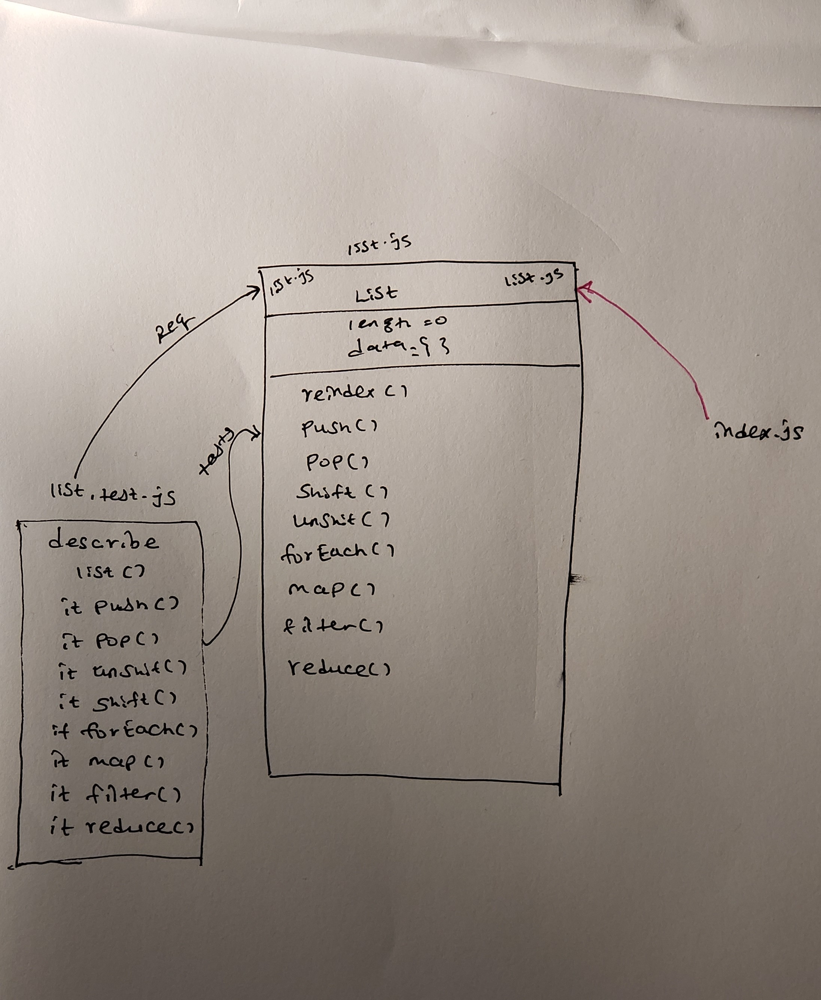

# LAB - 02

### Author: Meron

### Links and Resources
* [submission PR](https://github.com/meron-401n14/Lab-02/pull/2)
* [travis-ci](https://www.travis-ci.com/meron-401n14/Lab-02)

#### Documentation

* [jsdoc] for validator-class.js, vehicle-class.js & list.js

## Modules
#### faker.js
#### validator.js
#### validator-class.js
#### validator.test.js
#### vehicle-class.js
#### vehicle-constructor.js
#### vehicle.test.js
#### lsit.js
#### list.test.js

### Exported Values and Methods
###### Car Motercycle/ 
###### Validator / class

#### to run the application use node index.js

#### Tests
* run  npm test for all tests

#### UML

